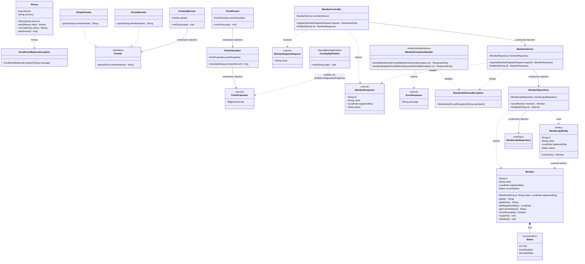

# クラス図（2026-07-12時点）

Level1〜4で作成したクラスの関係を示す。VSCodeでは、Mermaid対応のMarkdownプレビュー拡張機能（例: "Markdown Preview Mermaid Support"）でこのファイルを開くと図として表示できる。

## 補足

- パッケージごとの区切りは、図中の`%%`コメント（コード上の見出し）で表現している（Mermaidの`namespace`構文は環境によって描画に失敗することがあるため使っていない）
- `..|>` は「インターフェースの実装」、`-->`（実線矢印）は「コンストラクタインジェクションによる依存」、`..>`（点線矢印）は「一時的な利用・変換・生成」を表す
- `member`パッケージの依存の流れは `MemberController → MemberService → MemberRepository → MemberJpaRepository` という、レイヤードアーキテクチャの典型的な構造になっている
- `MemberJpaEntity`と`Member`（ドメイン）は、互いに参照し合わず、`MemberJpaEntity`側が一方的に変換責任を持つ形にしている（ドメインをJPAの都合から独立させるため）

### パッケージ対応表

| パッケージ | クラス |
|---|---|
| `com.training.issuing.domain` | `Money`, `Member`, `Status`（`Member`の内部enum）, `InsufficientBalanceException` |
| `com.training.issuing.greeting` | `Greeter`, `SimpleGreeter`, `FormalGreeter`, `GreetingRunner` |
| `com.training.issuing.point` | `PointProperties`, `PointCalculator`, `PointRunner` |
| `com.training.issuing.member` | `MemberRegisterRequest`, `MemberResponse`, `ErrorResponse`, `MemberNotFoundException`, `MemberController`, `MemberExceptionHandler`, `MemberService`, `MemberRepository`, `MemberJpaEntity`, `MemberJpaRepository` |
| `com.training.issuing`（ルート） | `IssuingApplication` |
